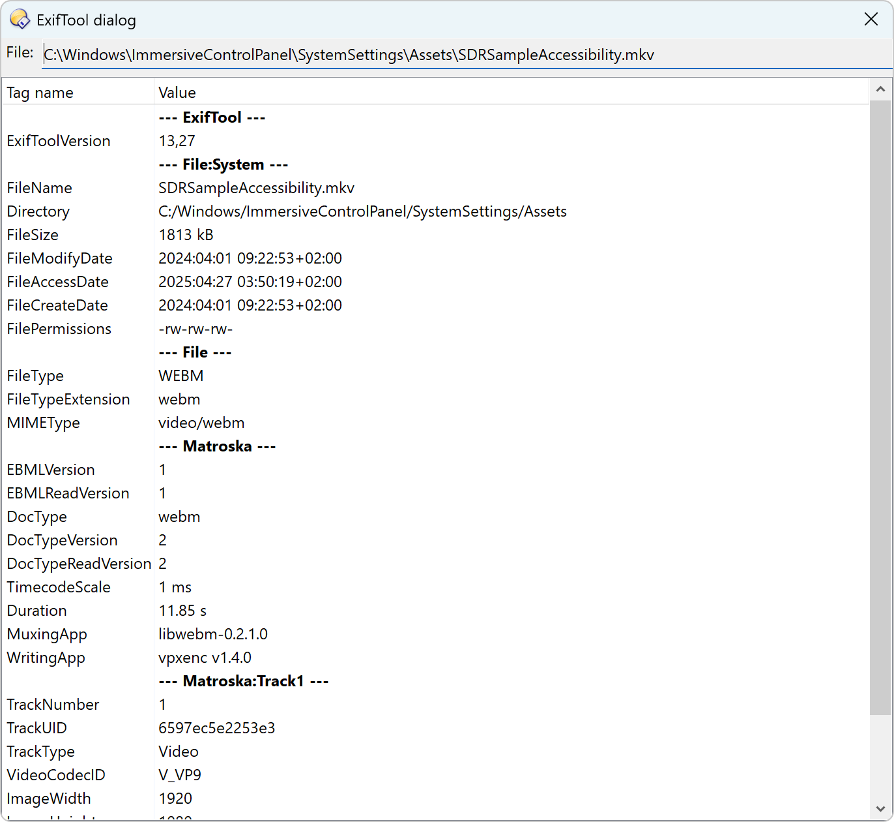
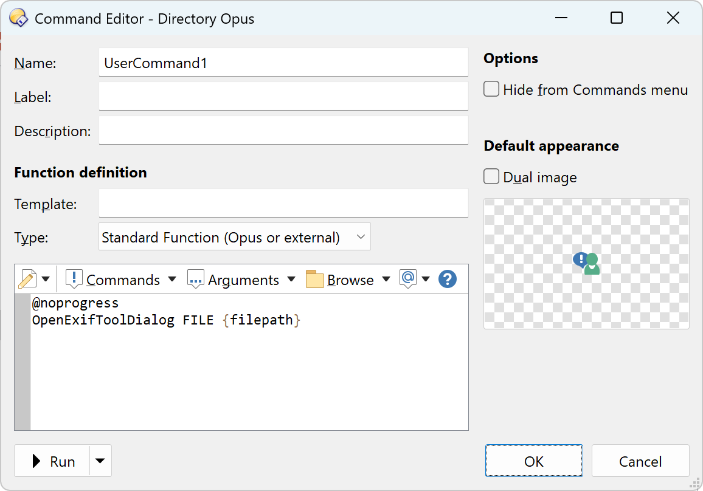

# DirectoryOpus-ExifTool-Dialog
The plugin to show file meta information using [ExifTool](https://exiftool.org/)<br>


# How it works
The plugin uses ExifTool COM class provided by [DOpus-Scripting-Extensions](https://github.com/PolarGoose/DOpus-Scripting-Extensions) project.<br>
ExifTool executable is started only once when Directory Opus is started. This makes the plugin work much faster than standalone GUI applications.

# How to use
* Install [DOpus-Scripting-Extensions](https://github.com/PolarGoose/DOpus-Scripting-Extensions)
  * Download the MSI from the [releases page](https://github.com/PolarGoose/DOpus-Scripting-Extensions/releases) and install it
* Download the `.js` file from [this project's releases page](https://github.com/PolarGoose/DirectoryOpus-ExifTool-Dialog/releases)
* Copy the `.js` file to the `%AppData%\GPSoftware\Directory Opus\Script AddIns` folder
* The command `OpenExifToolDialog` becomes available in the Directory Opus `Command Editor`.<br>Using this command, you can create a custom button or a hotkey.<br>
  ```
  @noprogress
  OpenExifToolDialog FILE {filepath}
  ```
  The `FILE` parameter is a file's full name.<br>
  The `@noprogress` attribute is needed to avoid the automatic progress bar dialog interfering with the ExifTool dialog.<br>
  

# References
* Discussion of this project on DOpus forum: [ExifTool GUI dialog](https://resource.dopus.com/t/exiftool-gui-dialog/55540/1)
